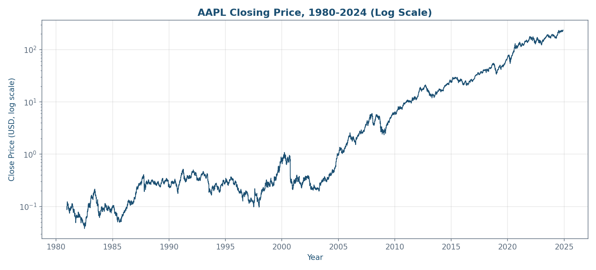
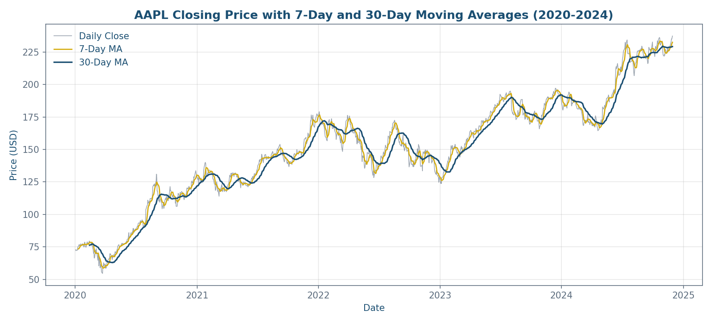
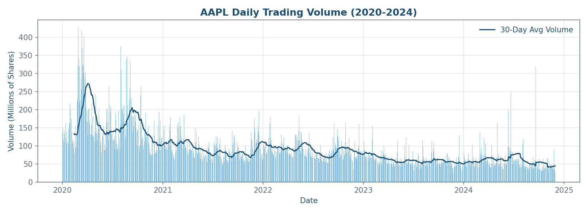
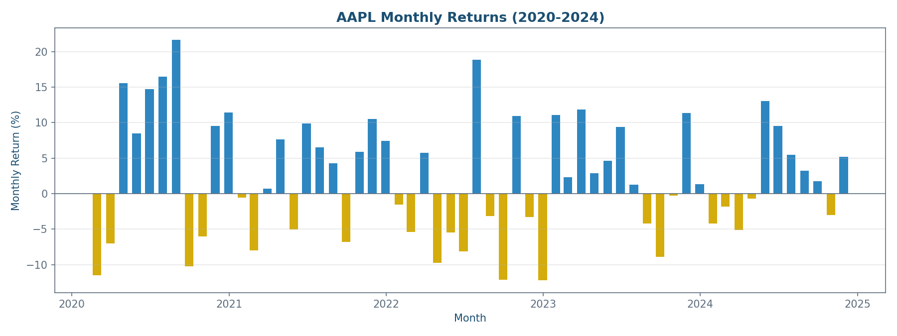
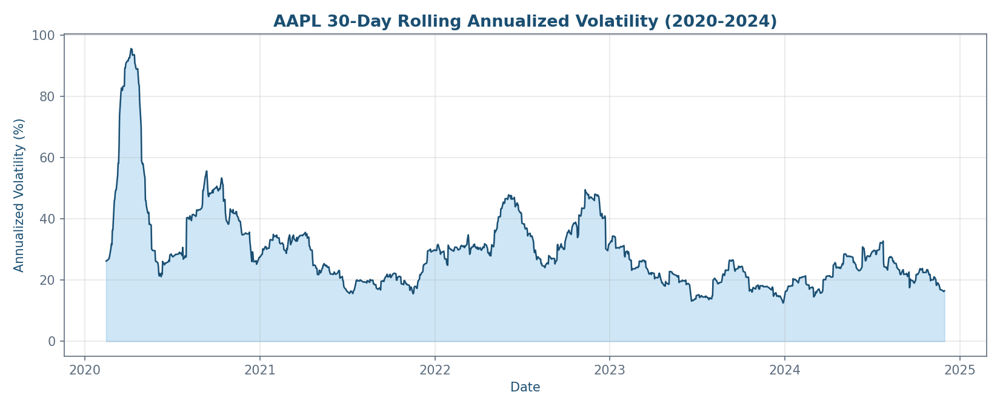

# AAPL Stock Analysis: Trend, Momentum and Volatility (2020-2024)

AnalystLab Africa Data Analytics Internship, Week 6: Advanced Python for Data Analysis.

## Project Overview

I applied advanced Pandas operations, time-series analysis and feature engineering to Apple
Inc. (AAPL) daily price data to answer three questions an investor or analyst would actually
ask about a stock: is it trending, when has it performed best and worst, and how has its risk
profile changed over time.

## Business Problem

A raw stock price chart tells you what happened. It does not tell you whether a rally is
sustained or short-lived, which periods carried the most risk, or how volatile the stock is
right now compared to its own history. This project builds the features (moving averages,
rolling volatility, monthly returns) that turn a raw price series into decision-relevant signals.

## Dataset

Daily OHLCV price data for AAPL, sourced from Yahoo Finance, covering December 12, 1980 (IPO)
through November 29, 2024: 11,084 trading days. Prices are split and dividend adjusted.

**On retrieval method:** the task specification for this week calls for pulling the data
directly with the `yfinance` Python library. My working environment while building this
notebook did not have outbound access to Yahoo Finance's API, so I sourced the equivalent data
as a CSV export of the same Yahoo Finance dataset (`data/AAPL_1980_2024_raw.csv`). The
`yfinance` code is included in the notebook's first code cell and is what produces the same
data when run with a normal internet connection.

Detailed feature engineering and analysis is scoped to 2020-2024, a five-year window that
covers the COVID-19 crash, the 2021 rally, the 2022 rate-driven drawdown and the 2023-2024
recovery. The full 44-year series is used once, for long-run price context only. I documented
this scoping decision directly in the notebook rather than silently filtering the data.

## Data Cleaning

The raw export required minimal cleaning, but I validated it rather than assuming it was clean:

| Issue Checked | Finding | Action Taken |
|---|---|---|
| Missing values | None found | No imputation required |
| Duplicate rows | None found | No removal required |
| Date format | Mixed timezone-aware string | Converted to timezone-naive datetime index |
| Column names | Mixed case | Standardized to lowercase |
| Data types | Correct on import | Explicitly enforced as float/int |
| OHLC logic errors | None found | Validated high >= low and all prices > 0 across all 11,084 rows |

## Features Engineered

- Daily price change and daily percentage return
- 7-day and 30-day rolling moving averages
- 30-day rolling annualized volatility (standard deviation of daily returns, scaled by
  sqrt(252) trading days)
- Monthly and yearly resampled returns

Chart 1 — chart1_full_history.png
Question it answers: How has AAPL grown over its entire trading history?



Chart 2 — chart2_moving_averages.png
Question it answers: Is the current price trend genuine and sustained, or short-term noise?



Chart 3 — chart3_volume.png
Question it answers: Is trading activity increasing or decreasing, and does it line up with major price moves?



Chart 4 — chart4_monthly_returns.png
Question it answers: Which months were strongest and weakest, and is there a seasonal pattern?



Chart 5 — chart5_volatility.png
Question it answers: How risky is this stock right now compared to its own history?



## Key Findings

- AAPL grew from a split-adjusted fraction of a dollar at IPO to over $230 by late 2024, with
  growth concentrated in specific multi-year windows rather than a smooth climb.
- The 7-day moving average led above the 30-day moving average for extended stretches of the
  2023-2024 recovery, a standard technical signal of sustained (not short-lived) upward momentum.
- Best month in the 2020-2024 window: August 2020, +21.66% return. Worst month: December 2022,
  -12.23% return, consistent with the broader 2022 rate-driven equity drawdown.
- Annualized volatility peaked at 95.6% on April 6, 2020 during the COVID crash, over 4x the
  stock's 2024 median baseline of roughly 22%. Volatility has compressed steadily since 2023.
- Average daily trading volume declined from 2021 onward even as the price climbed, suggesting
  steadier institutional conviction rather than high-frequency speculative flow.

## Recommendations

- Use the 7-day/30-day moving average crossover as a transparent, rules-based signal for entry
  and exit timing screening.
- Size positions and set stop-loss width using the rolling volatility feature: wider stops
  during high-volatility regimes like March/April 2020, tighter stops during compressed periods
  like 2024.
- Extend this analysis by benchmarking AAPL against the S&P 500 or Nasdaq-100 over the same
  window, to separate stock-specific performance from broad market movement.

## Repository Structure

```
AAPL-Stock-Analysis/
├── README.md
├── notebook/
│   └── AAPL_Stock_Analysis.ipynb      Full analysis: loading, cleaning, feature engineering,
│                                        time-series analysis, 5 visualizations, findings
├── data/
│   └── AAPL_1980_2024_raw.csv         Raw daily OHLCV data, 1980-2024
├── charts/
│   ├── chart1_full_history.png        Full 44-year closing price, log scale
│   ├── chart2_moving_averages.png     Closing price with 7-day and 30-day moving averages
│   ├── chart3_volume.png              Daily trading volume with 30-day average
│   ├── chart4_monthly_returns.png     Monthly returns, 2020-2024
│   └── chart5_volatility.png          30-day rolling annualized volatility
└── reports/
    └── AAPL_Insight_Summary.docx      1-2 page summary report
```

## Tools Used

Python, Pandas, NumPy, Matplotlib, Jupyter Notebook.

## Author

Timothy Kehinde Promise
Data Analyst Intern, AnalystLab Africa
[Portfolio](https://bit.ly/4qIn19W)
